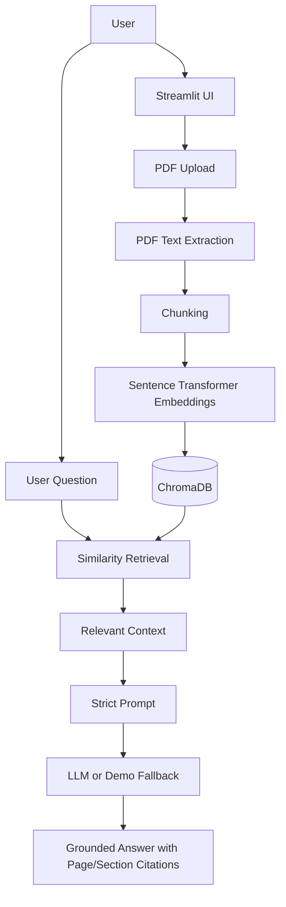

# System Architecture

The UI accepts a PDF and questions. Extraction preserves pages; chunking keeps manageable passages; embeddings enable meaning-based matching; ChromaDB retains them locally. Retrieval supplies evidence to a strict prompt. The final response displays only retrieved evidence plus its actual metadata.
